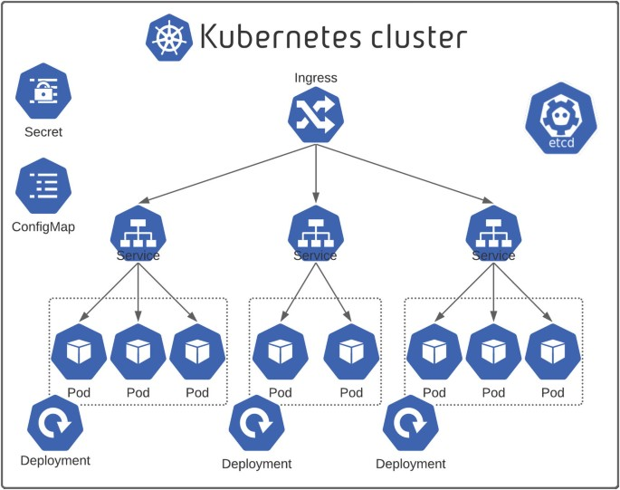

# Kubernetes Experiments 🚢

> Kubernetes experiment playground for the purpose of learning and gaining practical experience with container orchestration in cloud environments.

In the summer of 2024, I experimented with Kubernetes with the purpose of learning the theoretical and practical aspects. I setup 6 projects and wrote shell scripts to get hands-on experience.

- **Project 1 - Redis:** This subdirectory involves basic Kubernetes components such as *Service*, *Deployment* and *Load Balancer*, defined through `.yaml` manifestations.

- **Project 2 - Nginx:** Focuses more on learning *Pods* and what distinguishes them from *Docker Containers*.

- **Project 3 - Mongo:** Involves *Mongo*, exploring components such as *ConfigMap* and *Secret* to store epersonal data in the manifestations

- **Project 4 - EKS:** Experimentation with automated *AWS EKS* (Elastic Kubernetes Service) setup and basic Kubernetes Pods in Python

- **Project 5 - SQL:** Data persistance through *Stateful* component

- **Project 6 - Wordpress:** Using *Helm* and *Kustomization* to remove manifestation redundancies and improving code maintenance